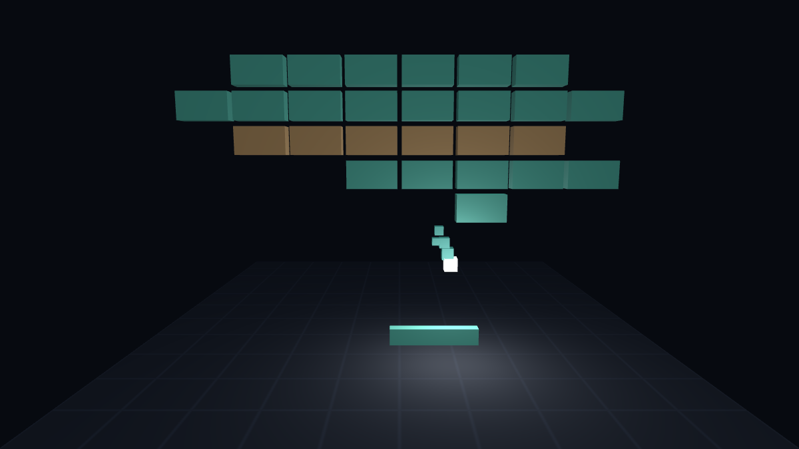

# Breakout 3D — hand-written WebGL2

A 3D brick breaker rendered by a small hand-written WebGL2 pipeline.
No engine, no framework, no runtime dependencies — plain ES modules and GLSL.

**Play:** https://fadhlillah2.github.io/breakout-3d-webgl/

## Controls

- Move the paddle: mouse / touch drag, or ← → (A/D)
- Serve: Space / Enter / click / tap
- Pause: Esc or P
- Mute: M
- After a game over, the serve input restarts

## Rules

- 3 lives; losing the ball behind the paddle costs one.
- Each level draws its wall from an ASCII pattern: bricks take one to three
  hits (the colour is the toughness, and cracks are drawn in the fragment
  shader), and steel bricks never break.
- Breaking a brick can drop a capsule — a wider paddle for 8 s, or a ball
  slowed to 75 % for 6 s. Which brick drops what is a hash of the level and the
  brick's slot, so a replay never diverges.
- A level ends when two breakable bricks are left, so it never turns into a hunt
  for stragglers; the survivors are paid for at the full brick price. The next
  level runs 0.4 units/s faster (cap 7.0; the paddle moves at 9.0 so it can
  always chase the ball), with a slightly narrower paddle (floor 0.5) and a
  different serve angle and palette.
- 5 points per non-fatal hit, 10 per brick broken, 100 per cleared level; best
  score in localStorage.
- Every brick broken before the ball comes home multiplies the brick price by
  one more step, up to ×5. The paddle, a lost ball and a new wall all end the
  rally, and the multiplier is the number that floats off the brick.

## Run locally

    npm start
    # open http://127.0.0.1:8000  (PORT=9000 npm start to move it)

`npm start` serves the folder with the same small Node static server the browser
tests use — nothing to install, and no Python needed.

## How it works

Four things carry the weight.

- **Matrices by hand.** `src/math.js` builds `perspective` and `lookAt` itself,
  and `src/camera.js` multiplies them into one view-projection that is cached
  until the aspect ratio or the camera moves. The eye it owns is read twice a
  frame: by the view matrix, and by the shader as the origin of the fog.
- **One shader block.** The hemisphere ambient, directional light, rim term,
  per-draw fog, `fwidth` floor grid, paddle contact shadow, procedural brick
  cracks and the ball's own point light all live in a single fragment shader —
  no second pass, no draw of their own, one program and one cube mesh for every
  body in the frame — 39 of them on a fresh wall, 46 in the busiest frame the
  smoke test captures.
- **Exact contact, adaptive sub-steps.** A frame is advanced in steps no longer
  than half a ball radius, capped at 16 — a belt the worst legal frame, six
  steps at the frame-time and speed caps, never reaches. A brick hit is an exact
  circle-vs-rect contact reflected about its normal, so a ball grazing the seam
  between two bricks never takes one out from a distance.
- **Seeded determinism.** Level layouts, capsule drops, serve angles and shard
  directions all come from a small integer hash of the game state: no
  `Math.random`, no clock reading anywhere in the simulation. That is what makes
  the gates possible — Node, headless Chrome and the screenshot replay the same
  game and compare the same numbers.

Each surface answers the ball differently. The paddle sets the exit angle
outright from the contact offset (16°–60° off vertical, so the middle of the
paddle steers as much as the tips do); the side walls and the ceiling flip one
component and leave the angle alone; and only a brick bounce runs the angle
clamp, which floors |vy| at 0.9 and then |vx| at 1.2 so the ball can settle into
neither a horizontal crawl nor a vertical loop.

## The files

- `src/game.js` — the whole simulation: DOM-free, WebGL-free, no clock.
- `src/math.js`, `src/camera.js` — 4×4 matrices; the camera is the only writer
  of the eye position, impact shake included.
- `src/gl.js` + `src/cube.js` — the renderer: one program, one cube mesh.
- `src/fx.js` — seeded brick shards and the distance-sampled trail, both pure.
- `src/sfx.js` — sounds synthesised from oscillators, muted state persisted.
- `src/input.js`, `src/storage.js` — key routing and the two persisted numbers,
  both kept DOM-free so the rules are testable.
- `src/main.js` — DOM wiring, pointer/keyboard input, HUD, impact feedback, and
  the tooling modes. Eight URL parameters: `?autotest=1`, `?shot=1`, `?nogl=1`
  and `?debug=1` choose a mode; `?ticks=` and `?end=` choose the scenario;
  `?w=`/`?h=` pin the size of the captured frame. Under `?debug=1` the live game
  object is hung on `window.__game` — a real handle, not a read-only copy, so a
  scripted playthrough can drive it.

## Tests

    npm test                      # node --test, 108 checks, no browser
    npm run smoke                 # 37 checks in headless Chrome + SwiftShader

`npm test` discovers `test/*.test.mjs` on its own: the simulation, the camera
and its projection, the shard and trail pools, the synthesised voices, storage,
key routing, and the markup and CSS invariants that live outside JavaScript.
`npm run smoke` needs `google-chrome` (or `CHROME=` pointing at one).

`tools/smoke.mjs` drives the page in `?autotest=1` mode (paddle tracking the ball,
fixed 60 Hz ticks) and compares the DOM status — state, score, HUD text and the
number of cubes the frame drew — against the same sequence computed in Node; it
also checks the miss and game-over scenarios, a deeper run whose frame draws a
steel brick, a cracked brick and a falling capsule at once, the WebGL2 fallback
(`?nogl=1`), that a pointer over the paddle's row is not swallowed by the ready
overlay, that the stage fits short viewports, that `prefers-reduced-motion` is
read rather than assumed, and that a full game still ends with localStorage
blocked. Headless Chrome clamps its window to 500 CSS px wide, so the narrow boot
really runs at 500×253, not at phone width.

`node scripts/screenshot.mjs` regenerates `screenshots/breakout-3d.png` from the
live `?shot=1` scene. One Chrome run produces both the PNG and the DOM the
anti-fabrication guard inspects (a live context that drew nothing is rejected too),
and the whole capture runs twice: the two PNGs must be byte-identical, so "the
shot mode is frozen" is a gate rather than a claim.

## Accessibility

- Playable from the keyboard alone: A/D or ← → move, Space/Enter serves,
  Esc or P pauses, M mutes, and every control has a visible focus ring.
- A permanent `<h1>`, a labelled canvas, and a polite live region that announces
  a lost life, a new level, the final score, and a keyboard mute toggle.
- `prefers-reduced-motion` is honoured end to end: the floating score numbers
  stop flying, and the shake, hit-stop, shards and trail are all switched off.
- The stage is capped to the viewport and the page still scrolls, so the paddle
  is never below the fold; on coarse pointers the buttons are at least 44 px.

## Limitations

- Gameplay is a classic 2D breakout plane rendered in 3D: ball, paddle and brick
  wall all travel in x/y at one fixed depth — the depth of each body is
  render-only — and the paddle only returns balls that reach its own height.
  There is no depth travel: an earlier fully-3D ball model produced phantom
  mid-air returns and vertical locks.
- Two capsule types only; no accounts or leaderboard. The sounds are
  synthesised from oscillators (no audio files) and can be muted from the HUD.
- Requires WebGL2; without it a fallback message is shown.
- The smoke test runs Chrome with SwiftShader: it verifies correctness, not GPU performance.

## Corrections to earlier commit messages

History is left as it was written; the record is corrected here instead.

- The device-pixel-ratio change is a **cap** — `Math.min(dpr || 1, 1.5)` — not a
  floor, as its commit message said. What that commit removed was the old 0.75
  cap that made narrow screens render soft.
- The screenshot defect was described as a capture-time resize redraw. The part
  that is certain is narrower: the frame the guard **inspected** was not the
  frame that reached the **PNG**. `?w`/`?h` now pin one frame for both, and the
  capture runs twice and must match byte for byte.

## Sibling project

[tower-stack-webgl](https://github.com/fadhlillah2/tower-stack-webgl)
([play](https://fadhlillah2.github.io/tower-stack-webgl/)) — the same
dependency-free WebGL2 setup; this repo's first commit vendored its `math.js`,
`cube.js` and `gl.js` before they grew apart.

## License

MIT — see [LICENSE](LICENSE).
